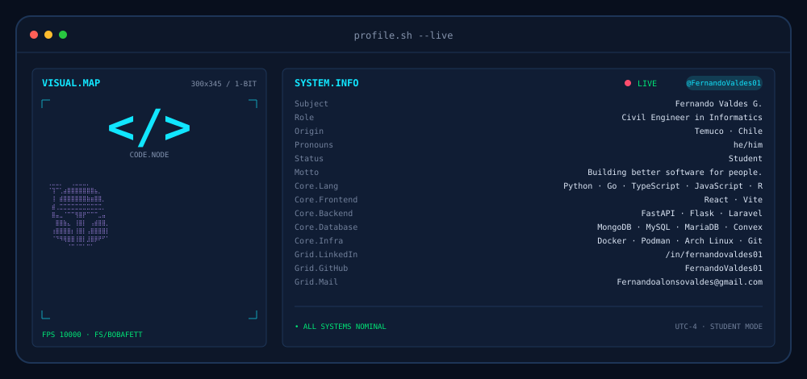

  

## Hello there 👾

I'm Fernando, a [Civil Engineer in Informatics](https://facultadingenieria.uct.cl/ingenieria-civil-en-informatica/) student from Temuco, Chile. I enjoy building backend services, working with data, and turning messy problems into tools people can actually use.

I'm currently focused on backend development, APIs, data-driven solutions, and learning whatever helps me build better software. When I'm away from the keyboard, I'm probably watching Star Wars.

> This is the way.

## Tech stack

  
  
  
  
  
  
  
  
  
  
  
  
  
  
  
  
  
  

  <a href="https://www.linkedin.com/in/fernandovaldes01/">LinkedIn</a> ·
  <a href="mailto:Fernandoalonsovaldes@gmail.com">Email</a>

## GitHub activity

  
  

  Made with code, curiosity, and a little bit of Mandalorian stubbornness.

