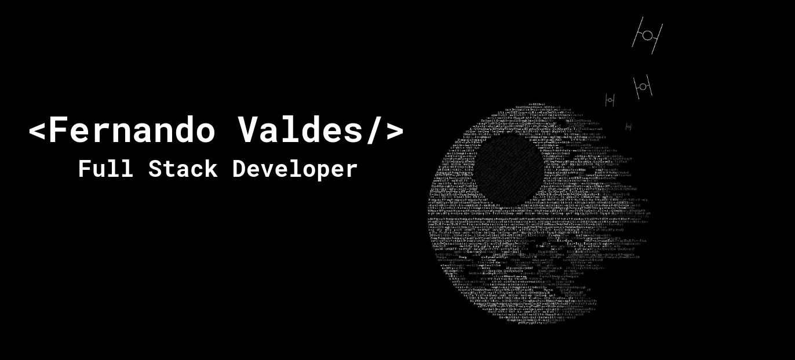

## Hello There 👾

I'm a [Civil Engineering student in computer science💻](https://facultadingenieria.uct.cl/ingenieria-civil-en-informatica/)with a strong commitment to technological innovation. I have built a solid foundation in web development—primarily as a backend developer—and I hold a keen interest in data science. Through rigorous study and practical experience, I strive to integrate engineering principles with cutting-edge technology solutions.
## Languages ​​I use daily🐊;

